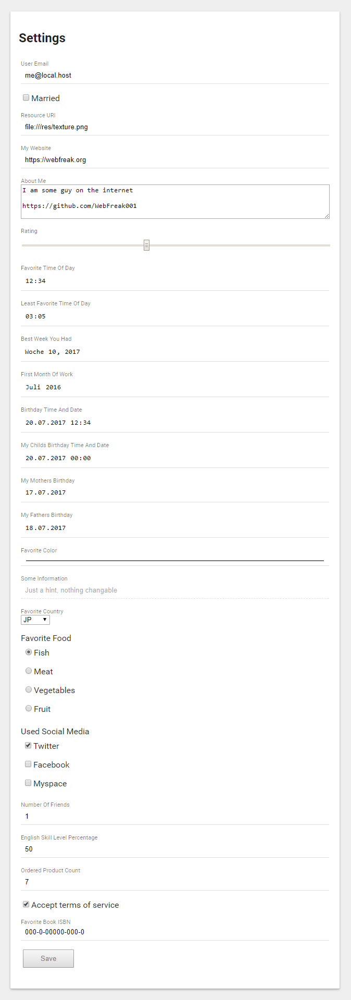

# web-config

A HTML settings/properties generator using D's Compile Time magic.

By default there is **no CSS**. Inputs will be ugly because the default generator does not emit any line breaks. You could make a custom generator and call the `DefaultInputGenerator` methods and add a line break but the recommended way is by making the `<label>` elements simply `display: block`.

You need to serve the CSS inside your head or add it to your existing stylesheet. Here are some preset styles (all styles are assuming you added class="settings" to any parent element or the form itself):

* [Material Design (Lite)](styles/material.min.css) (small & simplistic)

_PRs Welcome!_

## Generation

The default generated output looks like this (but more minified):

```html
<form action="/settings" method="POST"> <!-- You can change action & method and even add raw attributes like a class name -->
	<label>
		<!--
			You can change this entire construct by
			providing a custom input generator. But
			changing the CSS is often enough.
		-->
		<span>My Setting</span>
		<input type="text" value="a tree"/>
	</label>
	...
	<input type="submit" value="Save"/>
</form>
<!-- Everything from here is replacable -->
<script id="_setting_script_">
...
</script>
```

## Example

```d
//import settings.aliases; // For shorter UDAs

enum FavoriteFood
{
	fish,
	meat,
	vegetables,
	fruit
}

enum Country
{
	none, AF, AX, AL, DZ, AS, AD, AO, AI, AQ, AG, AR, AM, AW, AC, AU, AT, AZ, BS, BH, BD, BB, BY, BE, BZ, BJ, BM,
	BT, BO, BA, BW, BR, IO, VG, BN, BG, BF, BI, KH, CM, CA, IC, CV, BQ, KY, CF, EA, TD, CL, CN, CX, CC, CO, KM,
	CG, CD, CK, CR, CI, HR, CU, CW, CY, CZ, DK, DG, DJ, DM, DO, EC, EG, SV, GQ, ER, EE, ET, FK, FO, FJ, FI, FR,
	GF, PF, TF, GA, GM, GE, DE, GH, GI, GR, GL, GD, GP, GU, GT, GG, GN, GW, GY, HT, HN, HK, HU, IS, IN, ID, IR,
	IQ, IE, IM, IL, IT, JM, JP, JE, JO, KZ, KE, KI, XK, KW, KG, LA, LV, LB, LS, LR, LY, LI, LT, LU, MO, MK, MG,
	MW, MY, MV, ML, MT, MH, MQ, MR, MU, YT, MX, FM, MD, MC, MN, ME, MS, MA, MZ, MM, NA, NR, NP, NL, NC, NZ, NI,
	NE, NG, NU, NF, KP, MP, NO, OM, PK, PW, PS, PA, PG, PY, PE, PH, PN, PL, PT, PR, QA, RE, RO, RU, RW, WS, SM,
	ST, SA, SN, RS, SC, SL, SG, SX, SK, SI, SB, SO, ZA, GS, KR, SS, ES, LK, BL, SH, KN, LC, MF, PM, VC, SD, SR,
	SJ, SZ, SE, CH, SY, TW, TJ, TZ, TH, TL, TG, TK, TO, TT, TA, TN, TR, TM, TC, TV, UM, VI, UG, UA, AE, GB, US,
	UY, UZ, VU, VA, VE, VN, WF, EH, YE, ZM, ZW
}

enum SocialMedia
{
	twitter = 1 << 0,
	facebook = 1 << 1,
	myspace = 1 << 2,
}

struct Config
{
	@requiredSetting // Must be filled out
	@nonAutomaticSetting // Don't auto sync when typing
	@emailSetting string userEmail;
	bool married;
	@urlSetting @settingLength(64) string resourceURI;
	// OR
	@settingLength(64) URL myWebsite;
	@multilineSetting @settingLength(1000) string aboutMe;
	@rangeSetting @settingRange(0, 10) int rating;
	@timeSetting string favoriteTimeOfDay;
	// OR
	TimeOfDay leastFavoriteTimeOfDay;
	@weekSetting string bestWeekYouHad;
	@monthSetting string firstMonthOfWork;
	// Timezone-less
	@datetimeLocalSetting string birthdayTimeAndDate;
	// OR
	DateTime myChildsBirthdayTimeAndDate;
	@dateSetting string myMothersBirthday;
	// OR
	Date myFathersBirthday;
	@colorSetting string favoriteColor;
	@disabledSetting string someInformation = "Just a hint, nothing changable";
	Country favoriteCountry;
	@optionsSetting FavoriteFood favoriteFood;
	BitFlags!SocialMedia usedSocialMedia;
	@settingTitle("If you don't have any you can still say 1 because you have yourself.")  // Hover & validation text
	@settingMin(1) int numberOfFriends;
	@settingRange(0, 100) @settingStep(0.1) double englishSkillLevelPercentage;
	@settingMax(10) ubyte orderedProductCount;
	@settingLabel("Accept terms of service") @requiredSetting bool acceptTOS;
	@settingPattern(`(ISBN\s+)?\d{3}-\d-\d{5}-\d{3}-\d`) string favoriteBookISBN;
}

Config settingsInstance; // You might fetch & save this per user or have it global like here, web-config only changes the contents of the struct

// Actual vibe.d routes: (GET /settings, POST /settings, POST /api/settings)
router.get("/settings", delegate(scope req, scope res) @safe{
	string settings = renderSettings(settingsInstance);
	res.writeBody(html.format(settings), "text/html");
});
router.post("/settings", delegate(scope req, scope res) @safe{
	// no-js & nonautomatic setting route
	auto ret = req.processSettings(settingsInstance);
	string settings = renderSettings(settingsInstance, ret);
	if (ret)
	{
		// Something changed, you can save here
	}
	res.render!("settings.dt", settings); // use with `|!= settings` in diet
});
router.post("/api/setting", delegate(scope req, scope res) @safe{
	// js route called for each individual setting
	if (req.processSettings(settingsInstance))
	{
		// Save settings
		res.writeBody("", 204); // Send 200 or 204
	}
	else
		res.writeBody("", HTTPStatus.badRequest);
});
```

(See unittest in [source/settings/package.d](source/settings/package.d) for HTML of this example)

